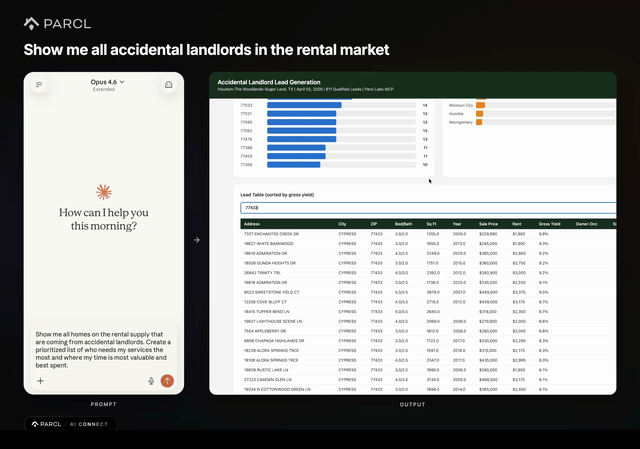
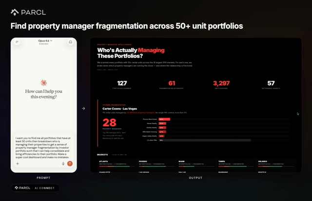
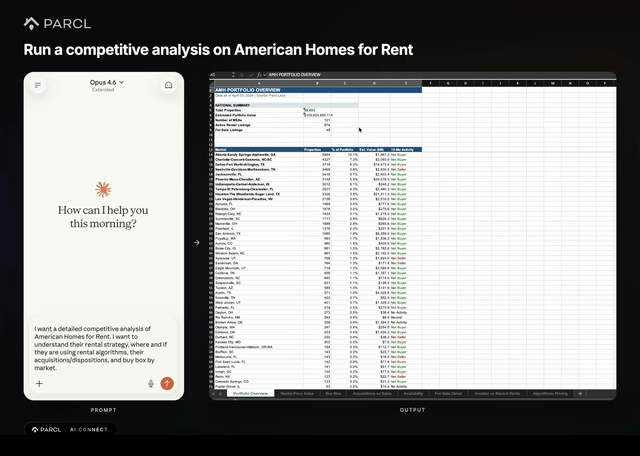
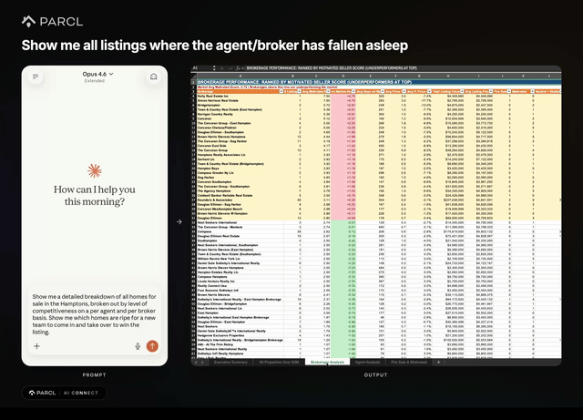

# Parcl AI Connect

**Real estate intelligence workflows powered by the Parcl Labs MCP.**

Turn 50,000+ US housing markets of data into actionable dashboards, reports, and lead lists using natural language prompts or automated Claude Code skills.


---

## How It Works

Parcl AI Connect provides ready-to-use workflows against the [Parcl Labs MCP](https://app.parcllabs.com/data-vault/ai-connect) server. Every use case comes in two flavors:

| Level | What It Is | How To Use |
|-------|-----------|------------|
| **Basic** | A copy-paste prompt | Paste into Claude Code. Works immediately. |
| **Advanced** | A Claude Code skill | Run `/<skill-name> [args]`. Automated, repeatable, production-grade. |

---

## Use Cases

### Lead Generation & Property Management

#### Accidental Landlord

Identify homeowners who failed to sell and pivoted to renting — the highest-intent PM leads in any market.



| | |
|---|---|
| **Output** | HTML dashboard of failed sellers who pivoted to renting with KPI strip, geographic distribution, and searchable lead table |
| **Basic** | [Prompt](use-cases/accidental-landlord/basic/PROMPT.md) |
| **Advanced** | `/accidental-landlord [market]` |
| **Details** | [Use case docs](use-cases/accidental-landlord/) |

#### PM Fragmentation

Surface portfolio owners using multiple PM companies — high-value consolidation targets for unified property management.



| | |
|---|---|
| **Output** | Interactive HTML dashboard with PM concentration scoring and opportunity classification per portfolio |
| **Basic** | [Prompt](use-cases/service-targeting/basic/PROMPT.md) |
| **Advanced** | `/pm-fragmentation [market]` |
| **Details** | [Use case docs](use-cases/service-targeting/) |

---

### Home Services Targeting

#### HVAC Direct Mail

Find aging, owner-occupied homes with long-tenure owners most likely to need HVAC replacement. Route-optimized for efficient canvassing.


| | |
|---|---|
| **Output** | Interactive HTML map with density clusters, original-owner flagging, and route-optimized CSV for direct mail drops |
| **Basic** | [Prompt](use-cases/hvac-direct-mail/basic/PROMPT.md) |
| **Advanced** | `/hvac-direct-mail [market]` |
| **Details** | [Use case docs](use-cases/hvac-direct-mail/) |

#### Pool Service Targeting

Identify new homeowners who just bought a home with a confirmed pool — the highest-conversion window for pool service companies.


| | |
|---|---|
| **Output** | Interactive HTML map with timing tiers (Strike Now / This Month / Follow-up), density clusters, and route-sequenced CSV |
| **Basic** | [Prompt](use-cases/pool-service-targeting/basic/PROMPT.md) |
| **Advanced** | `/pool-service-targeting [market]` |
| **Details** | [Use case docs](use-cases/pool-service-targeting/) |

---

### Investment & Underwriting

#### Market Study

Generate institutional-grade market study PDFs with quarterly KPI matrices, supply-demand analysis, and investor metrics.


| | |
|---|---|
| **Output** | Comprehensive PDF with KPI matrices, supply-demand divergence charts, seller stress analysis, and market outlook |
| **Basic** | [Prompt](use-cases/market-study/basic/PROMPT.md) |
| **Advanced** | `/market-study [market]` |
| **Details** | [Use case docs](use-cases/market-study/) |

#### Acquisition Targeting

Identify SFR portfolios showing disposition signals as bulk acquisition targets in secondary markets.


| | |
|---|---|
| **Output** | HTML dashboard with portfolio cards scored by criteria match, buy box analysis, for-sale listings with agent contact info |
| **Basic** | [Prompt](use-cases/underwriting/basic/PROMPT.md) |
| **Advanced** | `/acquisition-targeting [markets]` |
| **Details** | [Use case docs](use-cases/underwriting/) |

---

### Competitive Intelligence

#### Competitor Analysis

Build comprehensive portfolio teardowns of any institutional SFR investor using Parcl Labs Portfolio Hunter.



| | |
|---|---|
| **Output** | 8-tab Excel workbook covering geographic footprint, buy box, transaction history, rental pricing, and algo-pricing detection |
| **Basic** | [Prompt](use-cases/competitive-landscape/basic/PROMPT.md) |
| **Advanced** | `/competitor-analysis [investor]` |
| **Details** | [Use case docs](use-cases/competitive-landscape/) |

---

### Agent & Broker Analytics

#### Broker Analytics

Rank brokers and agents by motivated seller distress signals. Identifies underperforming listing agents with distressed inventory.



| | |
|---|---|
| **Output** | 5-sheet Excel workbook with brokerage/agent rankings, fire sale detail, and "vs Market Avg" delta scoring |
| **Basic** | [Prompt](use-cases/agent-analytics/basic/PROMPT.md) |
| **Advanced** | `/broker-analytics [market]` |
| **Details** | [Use case docs](use-cases/agent-analytics/) |

---

## Getting Started

### Prerequisites

The Parcl Labs MCP requires an active Parcl Labs account on either the **Operator** or **Insider** plan. Both plans include full MCP access.

1. [Create a Parcl Labs account](https://app.parcllabs.com/) if you don't have one
2. [Upgrade to the Operator or Insider plan](https://app.parcllabs.com/account/subscriptions)
3. Install the MCP server in your preferred client using one of the methods below
4. **Authenticate** — the first time your client connects to the MCP, an OAuth prompt will open in your browser asking you to authorize access to your Parcl Labs account. Verify the callback URL, click **Connect**, and you're in

### Quick Install

Click a button to install the Parcl Labs MCP server in your preferred client:

[](https://vscode.dev/redirect/mcp/install?name=Parcl%20AI%20Connect&config=%7B%22type%22%3A%22http%22%2C%22url%22%3A%22https%3A%2F%2Fmcp.parcllabs.com%2Fmcp%22%7D)
[](https://insiders.vscode.dev/redirect/mcp/install?name=Parcl%20AI%20Connect&config=%7B%22type%22%3A%22http%22%2C%22url%22%3A%22https%3A%2F%2Fmcp.parcllabs.com%2Fmcp%22%7D&quality=insiders)
[](https://vs-open.link/mcp-install?%7B%22type%22%3A%22http%22%2C%22url%22%3A%22https%3A%2F%2Fmcp.parcllabs.com%2Fmcp%22%7D)
[](https://cursor.com/en/install-mcp?name=Parcl%20AI%20Connect&config=eyJ0eXBlIjoiaHR0cCIsInVybCI6Imh0dHBzOi8vbWNwLnBhcmNsbGFicy5jb20vbWNwIn0=)

### Standard MCP Config

This configuration works across most clients:

```json
{
  "servers": {
    "Parcl AI Connect": {
      "type": "http",
      "url": "https://mcp.parcllabs.com/mcp"
    }
  }
}
```

### Domain Allow List

If your client or network restricts outbound connections, add the following domain to your allow list:

| Domain | Purpose |
|---|---|
| `mcp.parcllabs.com` | MCP server endpoint (all data and tool calls) |

Some clients enforce domain restrictions by default. See the client-specific instructions below for details.

### Client Setup Instructions

<details>
<summary><strong>VS Code</strong></summary>

**One-click install**

[](https://vscode.dev/redirect/mcp/install?name=Parcl%20AI%20Connect&config=%7B%22type%22%3A%22http%22%2C%22url%22%3A%22https%3A%2F%2Fmcp.parcllabs.com%2Fmcp%22%7D)

**Or install via CLI**

```bash
code --add-mcp '{"name":"Parcl AI Connect","type":"http","url":"https://mcp.parcllabs.com/mcp"}'
```

**Or add manually**

Add to your `.vscode/mcp.json` or user `settings.json` under `mcp.servers`:

```json
{
  "servers": {
    "Parcl AI Connect": {
      "type": "http",
      "url": "https://mcp.parcllabs.com/mcp"
    }
  }
}
```

**Domain allow list**

If you have sandboxing enabled, add the domain to `allowedDomains`:

```json
{
  "servers": {
    "Parcl AI Connect": {
      "type": "http",
      "url": "https://mcp.parcllabs.com/mcp",
      "sandboxEnabled": true,
      "sandbox": {
        "network": {
          "allowedDomains": ["mcp.parcllabs.com"]
        }
      }
    }
  }
}
```

See the [VS Code MCP docs](https://code.visualstudio.com/docs/copilot/customization/mcp-servers) for full details.

</details>

<details>
<summary><strong>VS Code Insiders</strong></summary>

**One-click install**

[](https://insiders.vscode.dev/redirect/mcp/install?name=Parcl%20AI%20Connect&config=%7B%22type%22%3A%22http%22%2C%22url%22%3A%22https%3A%2F%2Fmcp.parcllabs.com%2Fmcp%22%7D&quality=insiders)

**Or install via CLI**

```bash
code-insiders --add-mcp '{"name":"Parcl AI Connect","type":"http","url":"https://mcp.parcllabs.com/mcp"}'
```

Configuration and domain allow list are identical to VS Code above.

</details>

<details>
<summary><strong>Visual Studio</strong></summary>

**One-click install**

[](https://vs-open.link/mcp-install?%7B%22type%22%3A%22http%22%2C%22url%22%3A%22https%3A%2F%2Fmcp.parcllabs.com%2Fmcp%22%7D)

**Or install manually**

1. Open the GitHub Copilot Chat window
2. Click the tools icon in the chat toolbar
3. Click **+ Add Server**
4. Fill in the configuration:
   - **Server ID**: `Parcl AI Connect`
   - **Type**: Select `http/sse`
   - **URL**: `https://mcp.parcllabs.com/mcp`
5. Click **Save**

See the [Visual Studio MCP docs](https://learn.microsoft.com/visualstudio/ide/mcp-servers) for full details.

</details>

<details>
<summary><strong>Cursor</strong></summary>

**One-click install**

[](https://cursor.com/en/install-mcp?name=Parcl%20AI%20Connect&config=eyJ0eXBlIjoiaHR0cCIsInVybCI6Imh0dHBzOi8vbWNwLnBhcmNsbGFicy5jb20vbWNwIn0=)

**Or install manually**

Go to **Cursor Settings > MCP > Add new MCP Server**. Use type `http` with URL `https://mcp.parcllabs.com/mcp`.

Or add directly to `~/.cursor/mcp.json`:

```json
{
  "mcpServers": {
    "Parcl AI Connect": {
      "url": "https://mcp.parcllabs.com/mcp"
    }
  }
}
```

**Domain allow list**

Cursor has a built-in agent firewall that restricts outbound domains by default. If MCP calls are blocked, add `mcp.parcllabs.com` to your domain allowlist in **Cursor Settings > Privacy > Allowed Domains**.

</details>

<details>
<summary><strong>Windsurf</strong></summary>

Add to `~/.codeium/windsurf/mcp_config.json`:

```json
{
  "mcpServers": {
    "Parcl AI Connect": {
      "serverUrl": "https://mcp.parcllabs.com/mcp"
    }
  }
}
```

Restart Windsurf completely after saving (closing the editor window is not enough).

See the [Windsurf MCP docs](https://docs.windsurf.com/windsurf/cascade/mcp) for full details.

</details>

<details>
<summary><strong>Claude Code</strong></summary>

```bash
claude mcp add "Parcl AI Connect" --url https://mcp.parcllabs.com/mcp
```

That's it. The server is immediately available in your session.

</details>

<details>
<summary><strong>Claude Desktop</strong></summary>

Add to your `claude_desktop_config.json`:

```json
{
  "mcpServers": {
    "Parcl AI Connect": {
      "type": "url",
      "url": "https://mcp.parcllabs.com/mcp"
    }
  }
}
```

See the [MCP quickstart guide](https://modelcontextprotocol.io/quickstart/user) for config file location by platform.

</details>

<details>
<summary><strong>OpenAI Codex CLI</strong></summary>

**Install via CLI**

```bash
codex mcp add "Parcl AI Connect" --url https://mcp.parcllabs.com/mcp
```

**Or add to config directly**

Add to `~/.codex/config.toml`:

```toml
[mcp_servers."Parcl AI Connect"]
url = "https://mcp.parcllabs.com/mcp"
```

See the [Codex MCP docs](https://developers.openai.com/codex/mcp) for full details.

</details>

<details>
<summary><strong>ChatGPT (Desktop & Web)</strong></summary>

Requires ChatGPT Pro, Team, Enterprise, or Edu with Developer Mode enabled.

1. Open **Settings > Connectors > Create**
2. Set **Connector URL** to `https://mcp.parcllabs.com/mcp`
3. Name it `Parcl AI Connect`
4. Save

Developer Mode must be enabled by a workspace admin under **Settings > Permissions & Roles > Developer mode**.

See the [ChatGPT MCP docs](https://help.openai.com/en/articles/12584461-developer-mode-apps-and-full-mcp-connectors-in-chatgpt-beta) for full details.

</details>

<details>
<summary><strong>GitHub Copilot Coding Agent</strong></summary>

Add to your repository's Copilot Coding Agent configuration:

```json
{
  "mcpServers": {
    "Parcl AI Connect": {
      "type": "remote",
      "url": "https://mcp.parcllabs.com/mcp",
      "tools": ["*"]
    }
  }
}
```

Configure under **Repository Settings > Copilot > Coding agent**.

See the [GitHub Copilot MCP docs](https://docs.github.com/en/copilot/how-tos/use-copilot-agents/coding-agent/extend-coding-agent-with-mcp) for full details.

</details>

### Use the Workflows

#### Option 1: Copy & Paste (Basic)

1. Browse the [use cases](#use-cases) above
2. Click the **Prompt** link for the use case you want
3. Copy the prompt into your AI coding client
4. Watch it build your dashboard/report

#### Option 2: Install Skills (Advanced)

Clone this repository into your project:

```bash
git clone https://github.com/parcl-ai/parcl-ai-connect.git
cd parcl-ai-connect
```

Skills are automatically discovered by Claude Code from `.claude/skills/`. Run any skill directly:

```bash
/accidental-landlord Houston
/competitor-analysis "Investor Name"
/pm-fragmentation top-10
/acquisition-targeting "Louisville, Columbus, Memphis"
/market-study Hamptons
/broker-analytics "Beverly Hills"
/hvac-direct-mail Houston
/pool-service-targeting Phoenix
```

---

## Repository Structure

```text
parcl-ai-connect/
├── .claude/
│   └── skills/                    # Advanced Claude Code skills
│       ├── accidental-landlord/   #   Lead gen pipeline
│       ├── competitor-analysis/   #   Portfolio teardown
│       ├── pm-fragmentation/      #   PM consolidation scoring
│       ├── acquisition-targeting/ #   Disposition signal detection
│       ├── market-study/          #   Institutional-grade PDF reports
│       ├── broker-analytics/      #   Agent/brokerage distress rankings
│       ├── hvac-direct-mail/      #   HVAC direct mail targeting
│       └── pool-service-targeting/#   Pool service new homeowner leads
├── use-cases/                     # Use case docs + basic prompts
│   ├── accidental-landlord/
│   ├── competitive-landscape/
│   ├── service-targeting/
│   ├── underwriting/
│   ├── market-study/
│   ├── agent-analytics/
│   ├── hvac-direct-mail/
│   └── pool-service-targeting/
├── assets/                        # Videos, GIFs, branding
├── docs/                          # Contributing guide
├── CLAUDE.md                      # Claude Code project config
└── README.md                      # You are here
```

---

## What Is the Parcl Labs MCP?

The Parcl Labs MCP provides programmatic access to residential real estate data covering 50,000+ US markets. It exposes tools for:

- **Property events**: listing, sale, rental, and price change histories
- **Market metrics**: housing stock, event counts, all-cash share
- **Price indices**: sale and rental price per square foot over time
- **Portfolio Hunter**: investor search, portfolio analysis, PM details
- **Motivated seller/renter scores**: distress signals at the property level

Every workflow in this repository is built on these tools.

---

## Contributing

See [docs/CONTRIBUTING.md](docs/CONTRIBUTING.md) for guidelines on adding use cases and skills.

## License

[MIT](LICENSE), Parcl Labs, 2026
