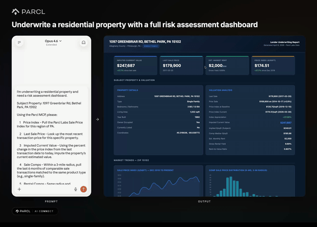
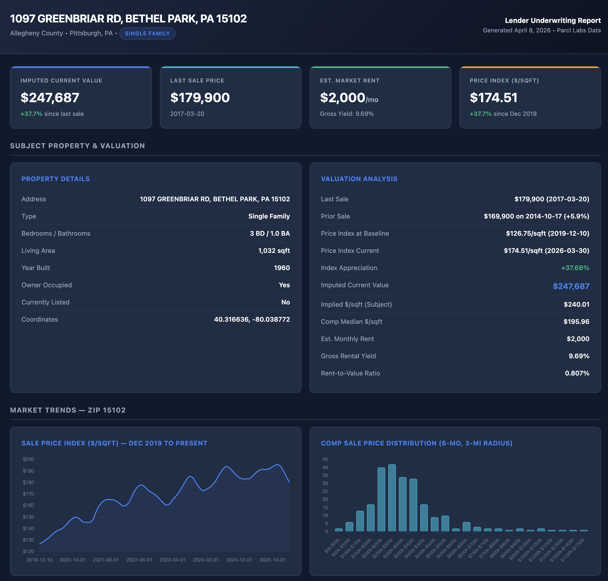

# Property Underwriter

Generate a lender-grade underwriting report for any US residential address. Imputes the current value from the Parcl Labs sale price index, pulls 3-mile comparable sales and rentals, computes gross yield, and renders everything in a polished dark-themed HTML dashboard.

## What You Get

- Imputed current value derived from the last sale price and the local sale price index
- 3-mile comparable sales (trailing 6 months) with bulk-transfer cleaning
- 3-mile comparable rentals with median rent and rent range
- Gross yield, rent-to-value ratio, and $/sqft positioning vs. the local market
- Methodology and risk notes covering index baseline gaps, new construction premiums, and institutional activity
- Single-page HTML report suitable for lending and credit review contexts

## Choose Your Path

### Basic (Copy & Paste)

Copy the prompt from [`basic/PROMPT.md`](basic/PROMPT.md) into Claude Code and swap in your subject address.

### Advanced (Skill)

Run `/property-underwriter [address]` for any US residential address. Address matching survives typos: if no exact match is found, the skill presents its best-guess candidate (with beds/baths/sqft so you can recognize the property) and asks you to confirm before underwriting — it never silently substitutes a different property or imputes a value from neighbors.

See the [skill definition](../../.claude/skills/property-underwriter/SKILL.md) for full details.

## How the Valuation Works

| Step | Method |
|---|---|
| Reference price | Most recent arm's-length sale of the subject property |
| Index ratio | Local sale price index ($/sqft) at sale date vs. today, most granular geography available (ZIP → county → metro) |
| Imputed value | `last_sale_price × (current_index / index_at_sale_date)` |
| Sanity check | Implied $/sqft compared against the 3-mile comp median |
