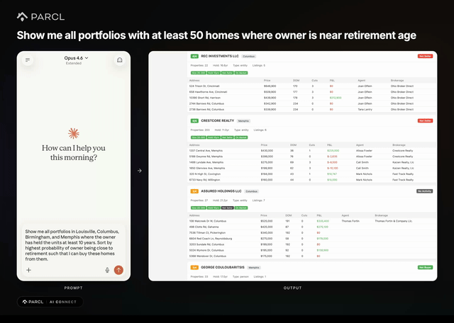

# Underwriting: Portfolio Acquisition Targeting

Identify SFR portfolios showing disposition signals as bulk acquisition targets. Uses progressive filter relaxation to find candidates even in smaller secondary markets where perfect matches are rare.

## What You Get

- HTML dashboard with portfolio cards scored by criteria match (X/4)
- Buy box analysis per portfolio (beds, baths, sqft, vintage, acquisition price)
- For-sale listing details with agent contact information
- CSV export for further research

## Choose Your Path

### Basic (Copy & Paste)

Copy the prompt from [`basic/PROMPT.md`](basic/PROMPT.md) into Claude Code. Targets Louisville, Columbus, Memphis, and Birmingham by default.

### Advanced (Skill)

Run `/acquisition-targeting [market1, market2, ...]` for any set of target markets with automated progressive search relaxation and portfolio scoring.

See the [skill definition](../../.claude/skills/acquisition-targeting/SKILL.md) for full details.

## Target Criteria

| Criterion | Threshold | Signal |
|---|---|---|
| Portfolio size | 20-300 doors | Large enough to need PM, small enough to sell |
| Holding period | 10+ years | Approaching natural exit window |
| Net Seller status | Trailing 12 months | Active liquidation signal |
| Active listings | 3+ for-sale | Currently marketing units |
